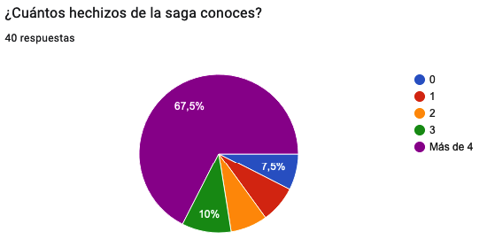
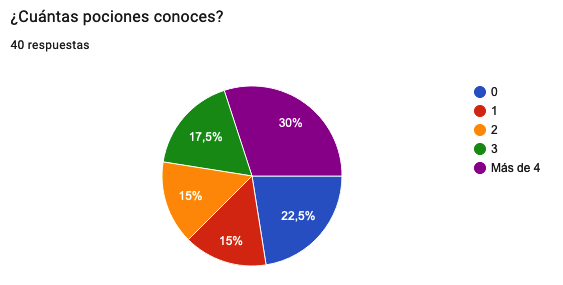
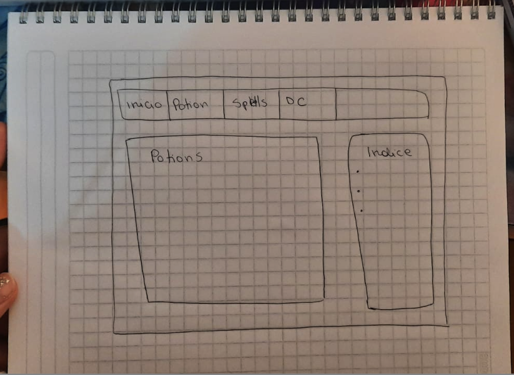
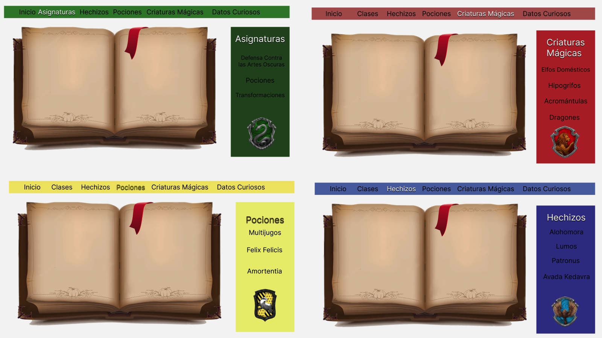
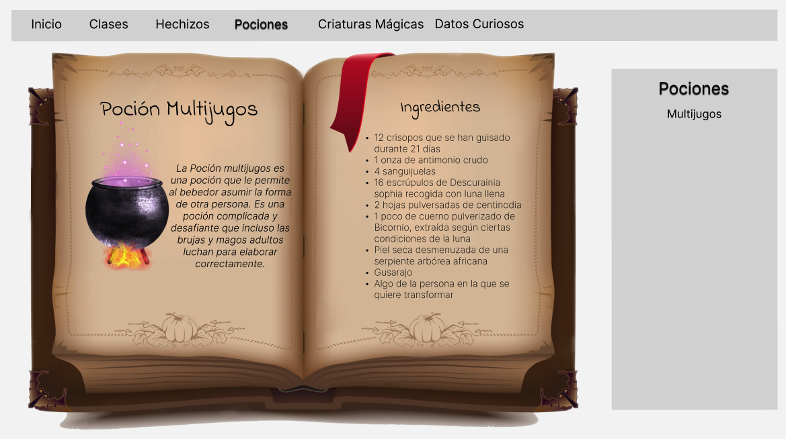

# Data Lovers

# 1.- Definición del Producto
Después de realizar un enfoque para nuestro usuario, este proyecto nace con la idea de ser un lugar de consulta para magos despistados que requieren reforzar y recordar constantemente algunas áreas del contenido impartido en las clases de Hogwarts. Es una plataforma donde pueden acceder a una lista de hechizos, o pociones y se les proporciona la información según requieran. 
La página busca ser una herramienta donde pueda encontrar rápidamente y de manera fácil, la información que el mago requiera, por esto cuenta con categorías claramente divididas y un orden alfabético ascendente y descendente para encontrar el contenido eficientemente. 

# 2.- Historias de usuario
Posterior a decidir hacer el proyecto de Harry Potter, y a realizar un formulario que fue rellenado por alrededor de 40 personas, consideramos que la página debía ir orientada a gente que disfruta y conoce el mundo de Harry Potter. Nos llamó la atención que muchos recordaban detalles de criaturas, clases o profesores muy específicos y esto nos hizo re-enfocar el proyecto  y cómo trabajaríamos la data entregada.

## Diseño de la Interfaz de Usuario
### Prototipos de baja fidelidad

Primeras ideas que se generaron respecto a nuestros objetivos planteados.

### Prototipos de alta fidelidad
Realizamos en Figma un prototipo para orientarnos en cómo queríamos entregar la información a nuestros usuarios.

# 3.-Objetivos de aprendizaje abordados

- **Uso de HTML semántico**
- **Uso de selectores de CSS**
- **Modelo de caja (box model): borde, margen, padding**
- **Uso de flexbox en CSS**
- **Uso de selectores del DOM**
- **Manejo de eventos del DOM (listeners, propagación, delegación)**
- **Manipulación dinámica del DOM**

- **Arrays (arreglos)**
- **Objetos (key, value)**
- **Variables (declaración, asignación, ámbito)**
- **Uso de condicionales (if-else, switch, operador ternario, lógica booleana)**
- **Funciones (params, args, return)**

- **Módulos de ECMAScript (ES Modules)**

- **Git: Instalación y configuración**
- **Git: Control de versiones con git (init, clone, add, commit, status, push, pull, remote)**
- **Git: Integración de cambios entre ramas (branch, checkout, fetch, merge, reset, rebase, tag)**
- **GitHub: Creación de cuenta y repos, configuración de llaves SSH**
- **GitHub: Despliegue con GitHub Pages**
- **GitHub: Colaboración en Github (branches | forks | pull requests | code review | tags)**

- **Diseñar un producto o servicio poniendo a la usuaria en el centro**

- **Seguir los principios básicos de diseño visual**
